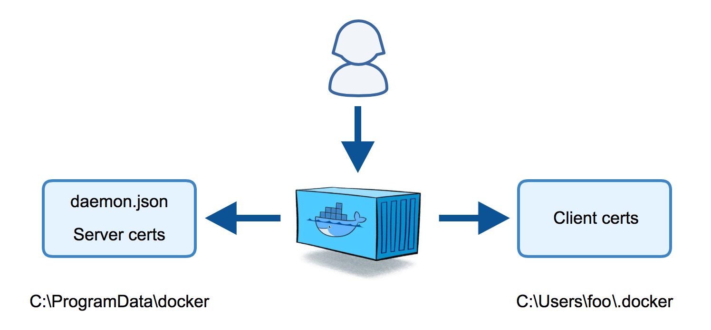
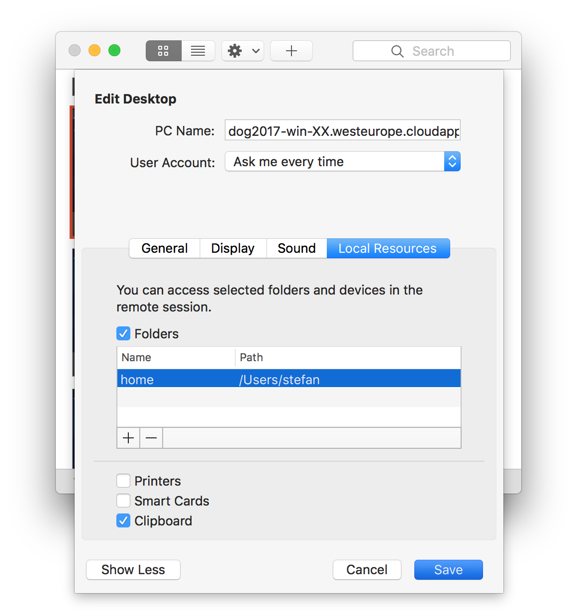
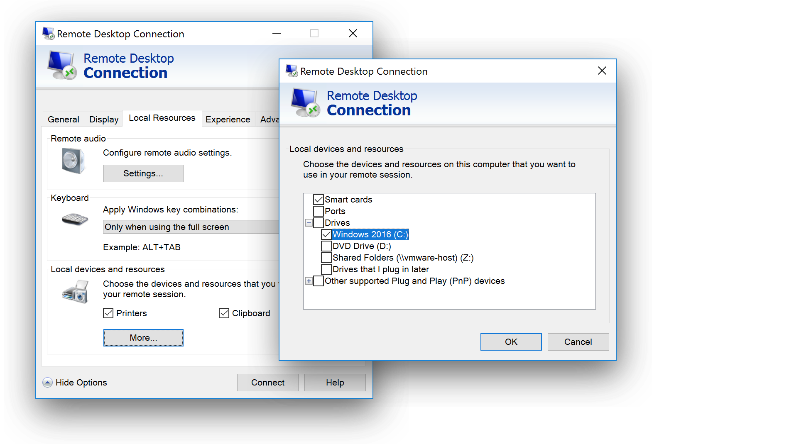
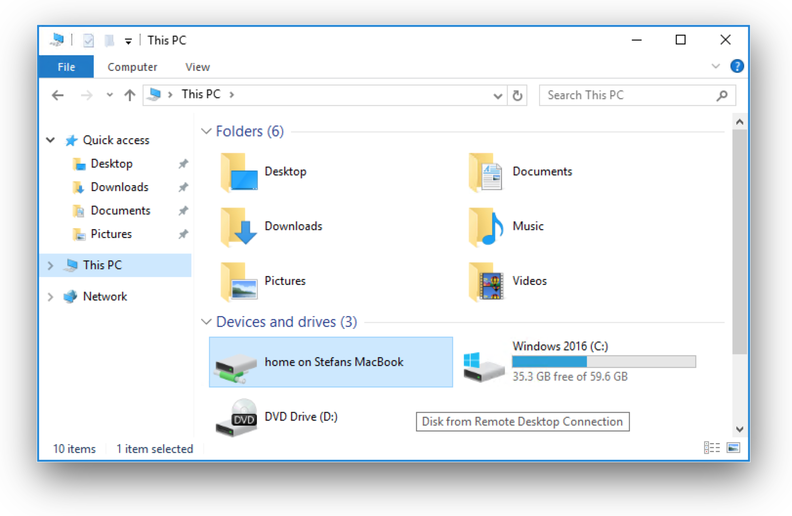

class: title

Docker on Windows <br/> Workshop

---
background-image: url(assets/mvp_docker_captain.png)

## Intros

- Hello! I am
  Stefan ([@stefscherer](https://twitter.com/stefscherer))
- I work at [sealsystems.de](https://sealsystems.de)
- I do open source at [github.com/StefanScherer](https://github.com/StefanScherer)
- I blog [stefanscherer.github.io](http://stefanscherer.github.io/)

---

## Agenda

<!--
- Agenda:
-->

.small[
- 17:00-17:30 get together with some Pizza
- 17:30-21:30 hands-on workshop
- 21:30-      get some more Pizza
]

<!--
- The tutorial will run from 1pm to 5pm
- This will be fast-paced, but DON'T PANIC!
- We will do short breaks for coffee + QA every hour
-->

- Feel free to interrupt for questions at any time

---

## Agenda

- Docker Fundamentals

- Setup Docker Engine on Windows Server 2016

- Learn about the base OS images

- Secure remote Docker access via TLS

- Networking

- Dockerfile best practices

- Persisting data using volumes

- Dockerizing a Windows application into containers

---

# Pre-requirements

- Computer with network connection and RDP client

  - on Windows, you are probably all set

  - on macOS, get Microsoft Remote Desktop from the App Store

  - on Linux, get [rdesktop](https://wiki.ubuntuusers.de/rdesktop/)

- Some Docker knowledge

  (but that's OK if you're not a Docker expert!)

---

## Nice-to-haves

- [Docker Client](https://docker.com/) if you want to remote control your Docker engine
  <br/>(available with Docker 4 Windows/Mac)

- [GitHub](https://github.com/join) account
  <br/>(if you want to fork the repo)

- [Gitter](https://gitter.im/) account
  <br/>(to join the conversation during the workshop)

- [Docker Hub](https://hub.docker.com) account
  <br/>(it's one way to distribute images on your Docker host)

---

## Hands-on sections

- The whole workshop is hands-on

- We will see Docker EE 18.03.1-ee-1 in action

- You are invited to reproduce all the demos

- All hands-on sections are clearly identified, like the gray rectangle below

.exercise[

- This is the stuff you're supposed to do!
- Go to [stefanscherer.github.io/windows-docker-workshop](https://stefanscherer.github.io/windows-docker-workshop/) to view these slides

- Join the chat room on
  [gitter.im/windows-docker-workshop/Lobby](https://gitter.im/windows-docker-workshop/Lobby)

]

---
background-image: url(assets/connect_rdp_docker.png)

## We will (mostly) interact with RDP only

- We can work through the RDP session

- When we have the TLS certs, we can do it from local machine through the Docker API

---
background-image: url(assets/powershell.png)

## Terminals

Once in a while, the instructions will say:
<br/>"Open a new terminal."

There are multiple ways to do this:

- open start menu, type `powershell` and click on the PowerShell icon

- press `[Windows] + R`, then enter `powershell` and press `[RETURN]`

You are welcome to use the method that you feel the most comfortable with.

---

## Brand new versions!

- Docker Enterprise Edition 18.03.1-ee-1
- Docker Compose 1.21.2

.exercise[
- Log into your Docker host through RDP (user and password is on your card)<br /><br />
  **`dowba-XX.westeurope.cloudapp.azure.com`**

- Open a terminal

- Check all installed versions:
  ```bash
  docker version
  ```

]

---

## Docker Fundamentals

- Docker Host

- Docker Engine

- Docker Image

- Docker Container

- Docker Registry

- Dockerfile

---
background-image: url(assets/what_is_a_container.png)

## What is a container?

- Standarized packaging for<br/>
  software and dependencies

- Isolate apps from each other

- Share the same OS kernel

- Works for all major Linux<br/>
  distributions

- Containers native to<br/>
  Windows Server 2016

---

class: title

# Setting up Docker Host

---

## Install Docker

- Install the Containers feature

- Install and start the Docker service

.exercise[
- Install Docker and feature with Microsoft's package:
  ```powershell
  Install-Module -Name DockerMsftProvider -Repository PSGallery -Force
  Install-Package -Name docker -ProviderName DockerMsftProvider
  Restart-Computer -Force
  ```

]

https://store.docker.com/editions/enterprise/docker-ee-server-windows
https://docs.microsoft.com/en-us/virtualization/windowscontainers/quick-start/

---

## Update your Host

- Install Windows updates for best container experience

.exercise[
- Run Server Configuration:
  ```powershell
  sconfig
  ```

- Choose option >> `6` << to Download and Install Updates

- Choose option >> `A` << to download all updates

]

---

## Check what you have done

- Check Docker Installation

.exercise[
- Get version and basic information:
  ```powershell
  docker version
  docker info
  ```

- Troubleshooting:
  ```powershell
  iwr https://aka.ms/Debug-ContainerHost.ps1 -UseBasicParsing | iex
  ```
]

https://github.com/Microsoft/Virtualization-Documentation

---

## Update Docker Engine

- If there is a new version of Docker Engine available

.exercise[
- Update to latest Docker Engine EE version:
  ```powershell
  Install-Package -Name docker -ProviderName DockerMsftProvider -Update -Force
  Start-Service docker
  docker version
  ```
]

---

## Add tab completion to PowerShell

- There is a PowerShell module [`DockerCompletion`](https://github.com/matt9ucci/DockerCompletion) to add tab completion for docker commands.

.exercise[

- Install the `DockerCompletion` module and edit your `$PROFILE`
  ```powershell
  Install-Module DockerCompletion -Scope CurrentUser
  notepad $PROFILE
  ```
- Add the module to the `$PROFILE` and save the file
  ```powershell
  Import-Module DockerCompletion
  ```
- Open a new PowerShell terminal
]


---

class: title

# Docker Images

---

background-image: url(assets/base_images.png)
# Windows base OS images

## FROM microsoft/windowsservercore
  * nearly full Win32 compatible
  * 5 GByte
  * Download once, Base layer shared with all Windows images

## FROM microsoft/nanoserver
  * fast to boot
  * 418 MByte
  * software may need porting
  * No 32bit, no MSI

## ~~FROM scratch~~

---

background-image: url(assets/base_images.png)
# Upcoming Windows 2019 base OS images

## FROM mcr.microsoft.com/windows
  * full Win32 compatible
  * 3,5 GByte

## FROM mcr.microsoft.com/windowsservercore
  * nearly full Win32 compatible
  * 1,5 GByte

## FROM mcr.microsoft.com/nanoserver
  * 94 MByte
  * No 32bit, no MSI, no PowerShell

---

## Base OS images

- Provided by Microsoft through the Docker Hub

- All Windows Docker images are based on one of these two OS images

.exercise[
- Pull or update to latest Windows base OS images:
  ```powershell
  docker image ls
  docker image pull microsoft/nanoserver
  docker image pull microsoft/windowsservercore
  ```
]

---

## Working with images

.exercise[
- Inspect an image:
  ```powershell
  docker image inspect microsoft/windowsservercore
  ```

- Tag an image:
  ```powershell
  docker image tag microsoft/windowsservercore myimage
  docker image tag microsoft/windowsservercore myimage:1.0
  docker image ls
  ```
]

---

class: title

# Containers

---

# Docker Image vs. Container

## Image

- Static snapshot of the filesystem and registry

## Container

- Runtime environment for processes based on an image

.exercise[
  ```powershell
  docker image --help
  docker container --help
  ```
]

---

## Run your first container

- Each container has its own environment
  - Host name
  - IP address
  - Environment variables
  - Current directory

.exercise[

  ```powershell
  docker container run microsoft/nanoserver hostname
  docker container run microsoft/nanoserver ipconfig
  docker container run microsoft/nanoserver cmd /c set
  docker container run microsoft/nanoserver cmd /c cd
  ```
]

---

## How many containers have you run?

--
- Answer: 4 (at least)

---

## Listing containers

- Each container has a container ID
- You can give them a name
- You can see if a container is running
- You can see the exit code of a container

.exercise[

- List running containers

  ```powershell
  docker container ls
  ```

- List also exited containers

  ```powershell
  docker container ls -a
  ```
]

---

## View the logs of containers

- You can see the logs, even after container has exited

.exercise[

- Get container ID of last container

  ```powershell
  docker container ls -lq
  ```

- Show output of last container

  ```powershell
  docker container logs $(docker container ls -lq)
  ```

]

---

## Modifying files in containers

- You can see what has changed in the filesystem

.exercise[

- Run a container that creates a file `test1.txt`

  ```powershell
  docker container run microsoft/nanoserver powershell -command Out-File test1.txt
  ```

- Show the differences between the container and the image

  ```powershell
  docker container diff $(docker container ls -lq)
  ```

]

---

## Analyzing the diff

- What are all the other file differences?
--

  - Windows processes write into files and registry
  - Other Windows services are running

- Have you created the file `test1.txt` on your Docker Host?
--

  - No, only inside that single container

.exercise[

- List current dir and `C:\` on your Docker Host

  ```powershell
  dir
  dir C:\
  ```

]

---

## Longer running processes

.exercise[

- Run a container with a longer running process

  ```powershell
  docker container run microsoft/nanoserver ping -n 30 google.de
  ```

- Try to abort the container with `[CTRL] + C` and list containers

  ```powershell
  docker container ls
  ```

- You only aborted the Docker client, not the container

]

---

## Interacting with containers

- Use `-it` to interact with the process in the container

.exercise[

- Run a container with a longer running process

  ```powershell
  docker container run -it microsoft/nanoserver ping -n 30 google.de
  ```

- Try to abort the container with `[CTRL] + C` and list containers

  ```powershell
  docker container ls
  ```

]

---

## Run an interactive container

- You also can work interactively inside a container

.exercise[

- Run a shell inside a container

  ```powershell
  docker container run -it microsoft/nanoserver powershell
  ls
  cd Users
  exit
  ```

]

---

## Run containers in the background

- Use `-d` to run longer running services in the background

.exercise[

- Run a detached "ping service" container

  ```powershell
  docker container run -d microsoft/nanoserver powershell ping -n 300 google.de
  ```

- Now list, log or kill the container

  ```powershell
  docker container ls
  docker container logs $(docker container ls -lq)
  docker container kill $(docker container ls -lq)
  ```

]

---

## Cleaning up your containers


.exercise[

- You can automatically remove containers after exit

  ```powershell
  docker container run --rm microsoft/nanoserver ping google.de
  ```

- You can remove containers manually by their names or IDs

  ```powershell
  docker container rm $(docker container ls -lq)
  ```

- You can remove all stopped containers

  ```powershell
  docker container prune
  ```

]

---

class: title

# Docker Registry

---

## Re-use the work of others

- The Docker Hub is a public registry for Docker images

.exercise[

- Search of images with the Docker client

  ```powershell
  docker search microsoft
  docker image pull microsoft/iis:nanoserver
  ```

- Go to https://hub.docker.com and search for images

]

---

## Run images from Docker Hub

- Docker Hub is a place for Linux, Intel, ARM, Windows, ...

.exercise[

- Try to run this Linux image

  ```powershell
  docker container run -it ubuntu
  ```

 ]

--

- Only Windows containers can be run on Windows Docker Hosts
- Only Linux containers can be run on Linux Docker Hosts
- But there will be LCOW to run Linux containers on Windows

---

## Run IIS web server

- Microsoft has some Windows application images

.exercise[

- Try to run this PowerShell

  ```powershell
  docker container run -d --name iis -p 80:80 microsoft/iis:nanoserver
  ```

- Now **on your local computer**, open a browser

  - http://dowba-XX.westeurope.cloudapp.azure.com

 ]

---

## Windows Containers don't do loopback

- At the moment you can't reach the published port 80 from the Docker Host

.exercise[

- Try to open the web site **from the Docker Host**

  ```powershell
  start http://localhost
  ```

- Or use the container IP address from the Docker Host

  ```powershell
  docker container inspect -f '{{.NetworkSettings.Networks.nat.IPAddress}}' iis
start http://$(docker inspect -f '{{.NetworkSettings.Networks.nat.IPAddress}}' iis)
  ```

 ]

---

## Windows Containers don't do loopback

- https://blog.sixeyed.com/published-ports-on-windows-containers-dont-do-loopback/


---

## A closer look into IIS container

- The IIS is serving a standard welcome page.
- Let's enter the container and look behind the scenes.

.exercise[

- Execute an interactive shell inside the still running IIS container

  ```powershell
  docker container exec -it iis powershell
  ```

- Go to the default folder with the web content of IIS

  ```powershell
  cd C:\inetpub\wwwroot
  dir
  ```

- Modify the `index.html` file, but there is no editor :-( So `exit` the terminal again.

 ]

---

## Serving own content with IIS

- The welcome page is nice, but we want to serve own content with IIS.

.exercise[

- Open an editor on your Docker Host and create a local file `iisstart.htm`

  ```html
  <html><body>Hello from Windows container</body></html>
  ```

- Copy that file `iisstart.htm` into the running container

  ```powershell
  docker container cp iisstart.htm iis:C:\inetpub\wwwroot
  ```

- Reload your browser

]

---

## Create a first own Docker image

- We have changed a container. Can we build a static image out of it?


.exercise[

- Commit the changes of the container into a new image

  ```powershell
  docker container commit iis mywebsite
  ```

- Stop the running IIS container as we cannot commit while running

  ```powershell
  docker container stop iis
  docker container commit iis mywebsite
  ```

- List the Docker images

]

---

## Run your first own container

- You have created your first image `mywebsite`.
- Now run a new container with it.

.exercise[

- Run your own website in a container

  ```powershell
  docker container run -d -p 80:80 --name web mywebsite
  docker container ls
  ```

- Now **on your local computer**, open a browser

  - http://dowba-XX.westeurope.cloudapp.azure.com

]

---

## Kill the container again

- Do some housekeeping and kill the container again

.exercise[

- Kill and remove the container

  ```powershell
  docker container kill web
  docker container rm web
  ```
]

---

class: title

# Dockerfile

---

## Describe how to build Docker images

- A `Dockerfile` is a text file with the description how to build a specific Docker image.

- Put into source code version control.

- Make the result repeatable by others.

- Or could you describe how to modify the IIS start page?

---

## Build your first Dockerfile

- Now put the pieces together and write a `Dockerfile` for the `mywebsite` image

.exercise[

- Open an editor and create a `Dockerfile`

  ```Dockerfile
  FROM microsoft/iis:nanoserver
  COPY iisstart.htm C:\inetpub\wwwroot
  ```

- Now build a new Docker image

  ```powershell
  docker image build -t bettersite .
  ```

- List Docker images and check image sizes

]

---

## Check what you have built

- Run a new container with the new image

.exercise[

- Run your better website

  ```powershell
  docker container run -d -p 80:80 --name web bettersite
  ```

- Check the web site in your browser.

]

---

## What went wrong?

- The IIS still publishes the standard welcome page. But why?
- Let's inspect the image to understand what happened


.exercise[

- Inspect the `bettersite` image

  ```powershell
  docker image inspect bettersite
  ```

- You may find a line with

  ```
  "#(nop) COPY file:6ef0...1d5c in C:inetpubwwwroot "
  ```

- Seems that we have problems with Windows paths.
]

https://blog.sixeyed.com/windows-dockerfiles-and-the-backtick-backslash-backlash/

---

## Escape the problem

- In a `Dockerfile` you can use a `\` backslash for line continuation.
- To produce a real backslash we have to use two `\\` backslashes.
- A better way is to switch to the PowerShell escape sign backtick.
- This is done with a comment in the first line.

.exercise[

- Open an editor and edit the `Dockerfile`

  ```Dockerfile
  # escape=`
  FROM microsoft/iis:nanoserver
  COPY iisstart.htm C:\inetpub\wwwroot
  ```

]

https://docs.docker.com/engine/reference/builder/#/escape

---

## Rebuild your Docker image

- Rebuild and run

.exercise[

- Kill the old web container, then rebuild and run a new container

  ```powershell
  docker container kill web
  docker container rm web
  docker image build -t bettersite .
  docker container run -d -p 80:80 --name web bettersite
  ```

- Check the web site in your browser.

]

---

## Other useful commands

- Show disk usage
- Clean up old images and containers

.exercise[

- Cleanup your host system and check sizes before and afterwards

  ```powershell
  docker system df
  docker system prune
  docker system df
  ```

]

---

class: title

# Secure remote
# Docker access via TLS

---

## Working with Docker remote API

- Docker remote API on port 2375 is not encrypted

- Protect your Docker Engine

  - nobody else from the Internet can connect to it
  - no other Container can connect to it

- Use TLS certificates for client and server

---

## DockerTLS

- OpenBSD LibreSSL tools

- PowerShell script to automate TLS cert generation

- A small containerized helper to create TLS certs for Docker Engine

https://stefanscherer.github.io/protecting-a-windows-2016-docker-engine-with-tls/

---

## DockerTLS



---

## Preparation steps

.exercise[

- Open a PowerShell terminal as administrator

- Create a folder for the client certs

  ```powershell
  mkdir ~\.docker
  ```

- Retrieve all local IP addresses

  ```powershell
  $ips = ((Get-NetIPAddress -AddressFamily IPv4).IPAddress) -Join ','
  Write-Output $ips
  ```

]

---

## Run DockerTLS

.exercise[

- Retrieve the public IP address

  ```powershell
  nslookup dowba-XX.westeurope.cloudapp.azure.com
  ```

- Run the dockertls container with local and public IP address (replace `x.x.x.x`)

  ```powershell
  docker container run --rm `
    -e SERVER_NAME=dowba-XX.westeurope.cloudapp.azure.com `
    -e IP_ADDRESSES=$ips,x.x.x.x `
    -v "C:\ProgramData\docker:C:\ProgramData\docker" `
    -v "$env:USERPROFILE\.docker:C:\Users\ContainerAdministrator\.docker" `
    stefanscherer/dockertls-windows
  ```

]

---

## Check what you have created

.exercise[

- Check client certs

  ```powershell
  dir ~\.docker
  ```

- Check server certs and `daemon.json`

  ```powershell
  dir C:\ProgramData\docker\certs.d
  cat C:\ProgramData\docker\config\daemon.json
  ```

]

---

## Activate TLS and test connection

.exercise[

- Activate the changes in `daemon.json`

  ```powershell
  Stop-Service docker
  dockerd --unregister-service   # get rid of -H options in command line
  dockerd --register-service
  Start-Service docker
  ```

- Test the TLS protected connection

  ```powershell
  docker --tlsverify -H 127.0.0.1:2376 version
  ```

]

---

## Prepare remote access

.exercise[

- Open firewall

  ```powershell
  & netsh advfirewall firewall add rule name="Docker TLS" `
      dir=in action=allow protocol=TCP localport=2376
  ```

- Copy client certs back to your local machine

  ```powershell
  docker --tlsverify -H dowba-XX.westeurope.cloudapp.azure.com:2376 version
  ```

]

---



Microsoft Remote Desktop Beta App on OSX

---




Microsoft Remote Desktop Client on Windows

---


Local folder shared in RDP session

---

class: title

# Networking

---

## Listing networks

- Default network is `nat`, there is also a `none` network.

.exercise[

- List all networks on the host

  ```powershell
  ipconfig
  ```

- The `vEthernet (HNS Internal NIC)` ethernet adapter is used by Docker containers

- List all container networks

  ```powershell
  docker network ls
  ```

]

---

## Networking modes

.exercise[

- Run a container with network

  ```powershell
  docker container run microsoft/nanoserver ipconfig
  ```

- Run a container without a network

  ```powershell
  docker container run --network none microsoft/nanoserver ipconfig
  ```

]

---

## DNS in Container network

- Container can lookup each other with DNS

.exercise[

- Run IIS again, as well as an interactive container

  ```powershell
  docker container run --name iis -p 80:80 -d microsoft/iis:nanoserver
  docker container run -it microsoft/nanoserver powershell
  ```

- Now inside the container, try to access the IIS web server by its DNS name


  ```powershell
  Invoke-WebRequest http://iis
  ```

]

- Don't forget to kill and remove the IIS container again.

---
background-image: url(assets/compose.png)

## Using Docker Compose

- A tool from Docker
- Define and run multi-container applications

---

## Installing Docker Compose

- Docker for Mac/Docker for Windows already has Docker Compose installed
- Installation on Windows Server 2016

.exercise[

- If you have [Chocolatey](https://chocolatey.org/) package manager

  ```powershell
  choco install docker-compose
  ```

- Otherwise download binary manually from https://github.com/docker/compose/releases

]

---

## The Compose file

- Docker Compose uses a `docker-compose.yml` file to define multiple services

- Define services in a Compose file
  ```
  version: '2.1'
  services:
      web:
        image: microsoft/iis:nanoserver
        ports:
          - 80:80
  ```

- Always append this to use the default nat network
  ```
  networks:
      default:
        external:
          name: nat
  ```

---

## Building images with Compose

- Docker Compose can use a `Dockerfile` per service to build an image locally

- Use `build:` instead of `image:`
  ```
  version: '2.1'
  services:
      web:
        build: .
        ports:
          - 80:80
  ```

---

## Networking with Compose

- The service names can be used to lookup them with DNS
  ```
  services:
      web:
        image: microsoft/iis:nanoserver
        ports:
          - 80:80

      client:
        image: microsoft/nanoserver
        command: powershell -Command Invoke-WebRequest http://web
  ```

---

## Practice DNS lookups with Compose

- We replay the manual test of IIS and a client container with Compose.

.exercise[

- Create a new folder
  ```powershell
  mkdir dnstest
  cd dnstest
  ```

- Create a `docker-compose.yml` file to test DNS lookups

  ```powershell
  notepad docker-compose.yml
  ```

]

---

.exercise[

- Create the `docker-compose.yml` with these two services

  ```powershell
  version: '2.1'
  services:
      web:
        image: microsoft/iis:nanoserver
        ports:
          - 80:80

      client:
        image: microsoft/nanoserver
        command: powershell -Command Sleep 2 ; Invoke-WebRequest http://web
        depends_on:
          - web

  networks:
      default:
        external:
          name: nat
  ```

]

---

## Run the first containers with Compose

- Compose can run all containers defined with one command

.exercise[

- Check the usage of `docker-compose`
  ```powershell
  docker-compose --help
  ```

- Run all containers
  ```powershell
  docker-compose up
  ```

- Press `[CTRL] + C` to stop all containers
- If client could not invoke the web request, try it again.
]

---

## Run containers in the background

- Compose can run containers in detached mode in background

.exercise[

- Run all containers in the background
  ```powershell
  docker-compose up -d
  ```

- Check which containers are running
  ```powershell
  docker-compose ps
  ```

- Check the output of the client in its logs
  ```powershell
  docker-compose logs -t client
  ```

]

---

## Networking resources

- [Container Networking](https://docs.microsoft.com/en-us/virtualization/windowscontainers/manage-containers/container-networking)

- [Use Docker Compose and Service Discovery on Windows](https://blogs.technet.microsoft.com/virtualization/2016/10/18/use-docker-compose-and-service-discovery-on-windows-to-scale-out-your-multi-service-container-application/)

- [Overlay Network Driver with Support for Docker Swarm Mode  on Windows 10](https://blogs.technet.microsoft.com/virtualization/2017/02/09/overlay-network-driver-with-support-for-docker-swarm-mode-now-available-to-windows-insiders-on-windows-10/)
---

class: title

# Dockerfile best practices

---

## Use single backslash

- Use the `escape` comment

  ```Dockerfile
  # escape=`
  FROM microsoft/iis:nanoserver
  COPY iisstart.htm C:\inetpub\wwwroot
  ```

- The `CMD` instruction is JSON formatted. You still need double backslash there.

- Alternative: Use "unix" slashes where ever you can. <br/>
  A lot of programs can handle it.

---

## Use PowerShell

- The default shell in Windows containers is `cmd.exe`.

- Using PowerShell gives you much more features eg. porting Linux Dockerfiles to Windows
  - Download files from the Internet
  - Extract ZIP files
  - Calculate checksums

- Example
  ```Dockerfile
  # escape=`
  FROM microsoft/windowsservercore
  RUN powershell -Command Invoke-WebRequest 'http://foo.com/bar.zip' `
                              -OutFile 'bar.zip' -UseBasicParsing
  RUN powershell -Command Expand-Archive bar.zip -DestinationPath C:\
  ```

---

## Switch to PowerShell

- Use the `SHELL` instruction to set PowerShell as default shell.
- So you don't have to write `powershell -Command` in each `RUN` instruction.

- Use `$ErrorActionPreference = 'Stop'` to abort on first error.

- Use `$ProgressPreference = 'SilentlyContinue'` to improve download speed.

  ```Dockerfile
  FROM microsoft/nanoserver

  SHELL ["powershell", "-Command", `
      "$ErrorActionPreference = 'Stop'; $ProgressPreference = 'SilentlyContinue';"]
  ```

---

## Using PowerShell in Dockerfile

- A full example to use PowerShell by default.

  ```Dockerfile
  # escape=`
  FROM microsoft/windowsservercore

  SHELL ["powershell", "-Command", `
      "$ErrorActionPreference = 'Stop'; $ProgressPreference = 'SilentlyContinue';"]

  RUN Invoke-WebRequest 'http://foo.com/bar.zip' -OutFile 'bar.zip' -UseBasicParsing
  RUN Expand-Archive bar.zip -DestinationPath C:\
  RUN Remove-Item bar.zip
  ```

--
- What's wrong with it?

---

## Download a temporary file

- Each `RUN` instruction builds one layer of your image.

--

- Removing a file of a previous layer does not shrink your final Docker image.

--

- Combine multiple commands to have an atomic build step for eg.
  - Download - Extract - Remove

  ```Dockerfile
  # escape=`
  FROM microsoft/windowsservercore

  SHELL ["powershell", "-Command", `
      "$ErrorActionPreference = 'Stop'; $ProgressPreference = 'SilentlyContinue';"]

  RUN iwr 'http://foo.com/bar.zip' -OutFile 'bar.zip' -UseBasicParsing ; `
        Expand-Archive bar.zip -DestinationPath C:\ ; `
        Remove-Item bar.zip
  ```

---

## But ...

- Use multiple `RUN` instructions while developing a Docker image

- You can benefit of layer caching.

- Downloading 1GB ZIP and doing the extract command wrong is painful.

--

- Experimental feature
  - `docker build --squash`

  - Squash all layers into one.
  - Use multiple `RUN` instructions to keep Dockerfile readable.

  - Docker still caches individual layers to make subsequent builds fast.

---

## Better: Use multi-stage builds

- A `Dockerfile` with multiple `FROM` instructions

- Each `FROM` starts a new stage

- Only the final stage will make it into your Docker image.

- Use earlier stages to build your app, eg. with a compiler

- Remove the compiler dependencies with a final `FROM`

https://stefanscherer.github.io/use-multi-stage-builds-for-smaller-windows-images/

---

## Resources for Dockerfile on Windows

- [Best practises for writing Dockerfiles](https://docs.docker.com/engine/userguide/eng-image/dockerfile_best-practices/#run)

- [Dockerfile on Windows](https://docs.microsoft.com/en-us/virtualization/windowscontainers/manage-docker/manage-windows-dockerfile)

- [Optimize Windows Dockerfiles](https://docs.microsoft.com/en-us/virtualization/windowscontainers/manage-docker/optimize-windows-dockerfile)

---

class: title

# Persisting data using volumes

---

## Using volumes

- A container is not able to persist data for you.

- If you kill a container and run a new container it starts in a fresh environment.

- Volumes can be used to persist data outside of containers.

.exercise[

- Write a small Dockerfile that reads and writes a file at runtime.
  ```Dockerfile
  FROM microsoft/nanoserver
  CMD cmd /c dir content.txt & echo hello >content.txt
  ```

- Build and run the container. Run it again.
  ```powershell
  docker build -t content .
  docker run content
  ```

]

---

## Prepare the image to have a volume mount point

- Now we prepare the Dockerfile with a workdir to add a volume at runtime.

.exercise[

- Add a `WORKDIR` to have an empty folder inside the container.
  ```Dockerfile
  FROM microsoft/nanoserver
  WORKDIR /data
  CMD cmd /c dir content.txt & echo hello >content.txt
  ```

- Build and run the container. Run it again.
  ```powershell
  docker build -t content .
  docker run content
  ```

]

---

## Adding a volume from host

- The file `content.txt` is still not persisted.

- Now add a volume from the host with the `-v` option.

.exercise[

- Run the container with a volume mount point.
  ```powershell
  docker run -v "$(pwd):C:\data" content
  ```

- It shows the same output, but look at the host directory. Run another container.
  ```powershell
  dir
  docker run -v "$(pwd):C:\data" content
  ```

]

---

## Use the VOLUME instruction

- There is a `VOLUME` instruction in Dockerfiles.

.exercise[

- Add a `VOLUME` to make it more readable.
  ```Dockerfile
  # escape=`
  FROM microsoft/nanoserver
  VOLUME C:\data
  CMD cmd /c dir c:\data\content.txt & echo hello >c:\data\content.txt
  ```

- Build and run the container. Run it again. Does it behave different?
  ```powershell
  docker build -t content .
  docker run content
  ```

]

---

## Windows volumes in practice

## Empty directory

- You can mount a volume only into an empty directory.

- The `microsoft/iis` default folder `C:\inetpub\wwwroot` is not empty.

## Real path problem

- Some applications try to get the **real path** of a file.
- They often fail at the reparse point.

- Use a mapped drive as a workaround.

---

## Use a mapped drive

- This is a workaround to run Node.js sources mounted from the host

```Dockerfile
# escape=`
FROM stefanscherer/node-windows:10

RUN npm install -g nodemon

VOLUME C:\code
RUN set-itemproperty -path `
    'HKLM:\SYSTEM\CurrentControlSet\Control\Session Manager\DOS Devices' `
    -Name 'G:' -Value '\??\C:\code' -Type String
WORKDIR G:\

CMD ["nodemon.cmd", "--debug=5858", "app.js"]
```

- The Node.js app is running in `G:\`, you still use `C:\code` for your volume.

---

## Third-party volume driver plugins

- [HPE Nimble Storage Volume driver and plugin](https://www.hpe.com/de/de/storage/containers.html)

---

class: title

# Dockerizing a Windows application into containers

---

## MusicStore example

- https://github.com/docker/labs/tree/master/windows/modernize-traditional-apps/modernize-aspnet

- https://github.com/aspnet/MusicStore

---

## Orchestrators?

- Docker Swarm

Work in progress:

- Kubernetes

- OpenShift

...

---

## Workhop done. Now where to build Windows containers?

- Windows 10
  - Docker 4 Windows (using Hyper-V)

- Azure
  - Windows Server 2016, 1709, 1803, 2019 preview

- AppVeyor CI
  - [github.com/StefanScherer/dockerfiles-windows](https://github.com/StefanScherer/dockerfiles-windows/pull/344) - collection
  - [github.com/StefanScherer/whoami](https://github.com/StefanScherer/whoami) - Multi-arch images
  
- In a local VM on Linux/Mac/Windows
  - [github.com/StefanScherer/windows-docker-machine](https://github.com/StefanScherer/windows-docker-machine)

---

## Further Windows related resources

- Follow Elton Stoneman on Twitter [@EltonStoneman](https://twitter.com/EltonStoneman)

- Another Docker on Windows workshop
  - [https://dwwx.space/](https://dwwx.space/)

- Windows related Docker Labs
  - [https://github.com/docker/labs/tree/master/windows](https://github.com/docker/labs/tree/master/windows)

---

class: title

# Thanks!  
Questions?

## [@stefscherer](https://twitter.com/stefscherer)

## [github.com/StefanScherer](https://github.com/StefanScherer)
