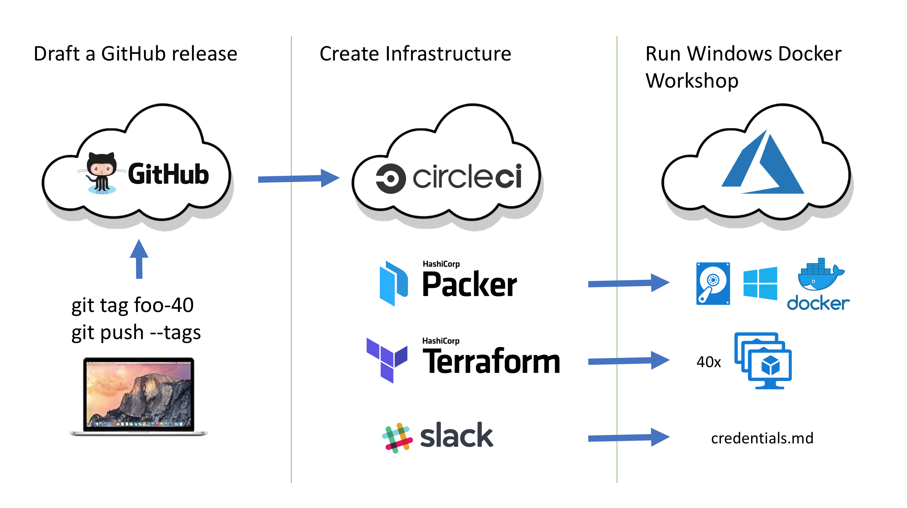

# Prepare VM's for the workshop

You can prepare the Windows Server 2016 VM's with one of these Terraform templates.

- AWS (outdated)
- Azure

## Full automated build

I've implemented a full automated build to run a Windows Docker Workshop very easily.

- Draft a new GitHub release
  - The tag name is `foo-40` to create 40 VM's with DNS prefix `foo`.
- CircleCI build is triggered
- A previous Packer build created a VM image with Docker and Tools.
- A Terraform build creates the 40 VM's with random passwords.
- A Slack notification is sent with all credentials.
- Print the credentials for each attendee and run the workshop :-)

